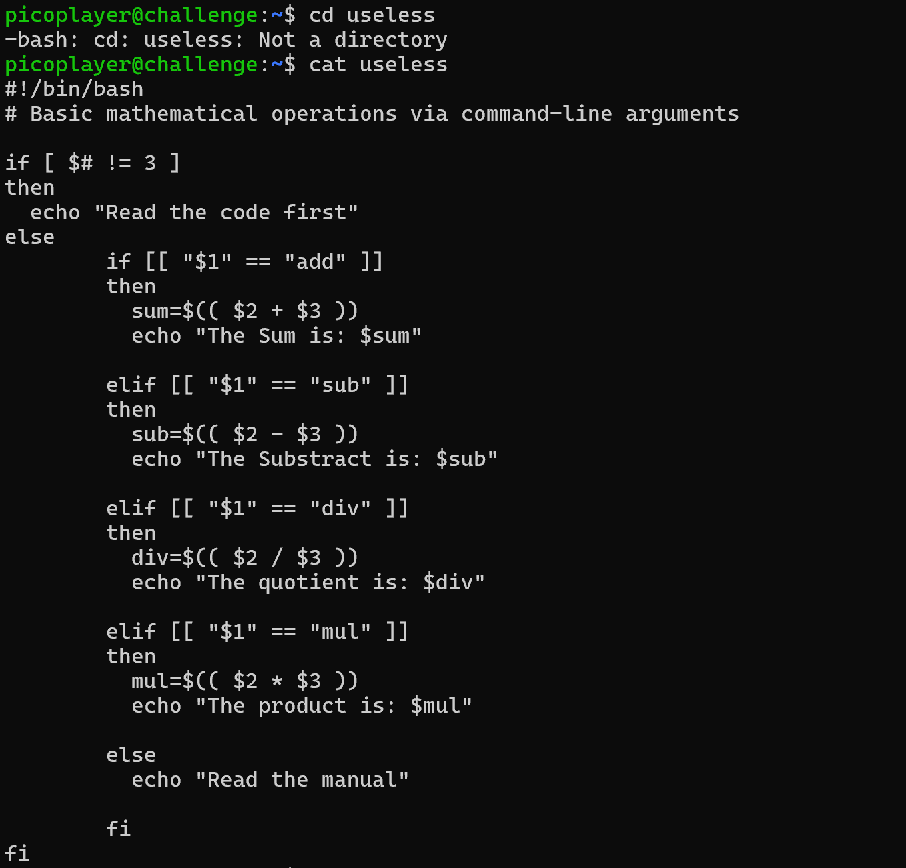

<h1 align="center">Useless</h1

There's an interesting script in the user's home directory
The work computer is running SSH. We've been given a script which performs some basic calculations, explore the script and find a flag.

| Hostname | Port | Username | Password |
|---------|------|----------|----------|
|saturn.picoctf.net|62787|picoplayer|password|


## Set Up SSH Connection

 ### 1. Open a Terminal
 You will use SSH (Secure Shell) to connect to the remote server.

### 2. Use the Provided SSH Command
 In your terminal, enter the following command to connect to the CTF server:

```
 ssh -p 62787 picoplayer@saturn.picoctf.net
```
This will connect you to the CTF server on port ```62787```

### 3. Enter the Password: 
When prompted, enter the provided password ```password```. after successfully connecting with ssh, here we need to explore skills. well here I use the command ```cat useless``` to display the contents of the useless file.



### 4. Explore the Script


```
picoCTF{us3l3ss_ch4ll3ng3_3xpl0it3d_5136}
```

